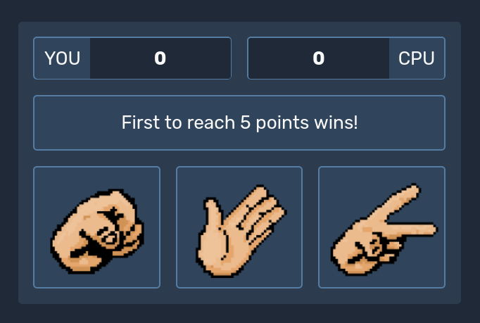

# Rock Paper Scissors

## Overview

The classic game **Rock Paper Scissors** now with a clean new UI. This project is part of _The Odin Project_ foundations course.

## How to Play

1. **Open the game**: Click [here](https://onesrx.github.io/odin-rock-paper-scissors/) to open the game.
2. **Make Your Move**: Click on the button representing your choice (rock, paper, or scissors).

3. **See the Result**: The computer will randomly choose its move, and each round result will be displayed on the screen.

4. **Score to Win**: The first to reach 5 points wins the game.

### Screenshot

