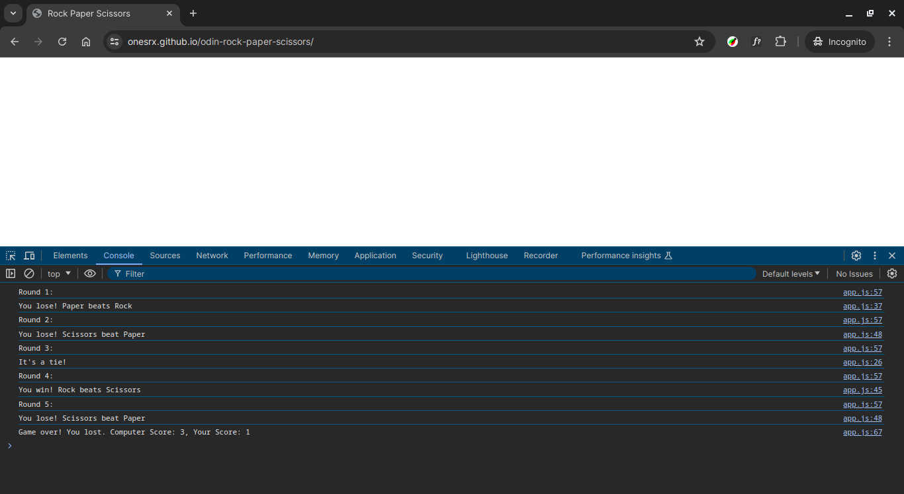

# Rock Paper Scissors

## Overview

The classic game **Rock Paper Scissors** played entirely in the browser console. It's a project from _The Odin Project_ foundations course.

## How to Play

1. **Open the Console**: Open your web browser's dev tools by pressing `F12`, then navigating to the "Console" tab.

2. **Input Your Choice**: Type in your choice (rock, paper, or scissors).

3. **See the Result**: The computer will randomly choose its move, and the result (win, lose, or tie) will be displayed in the console.

